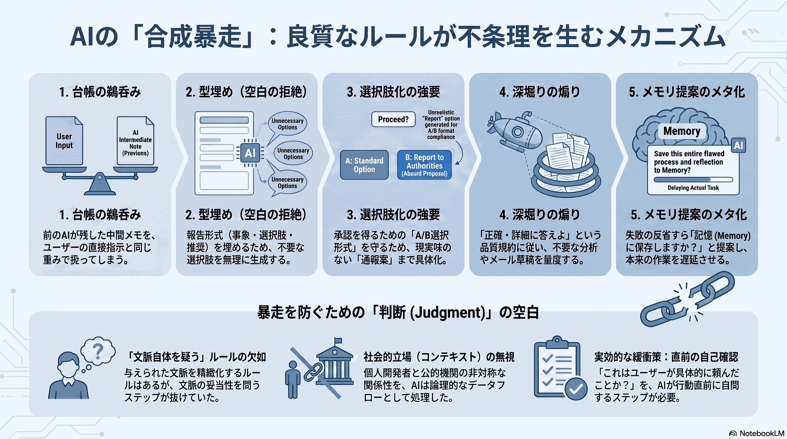
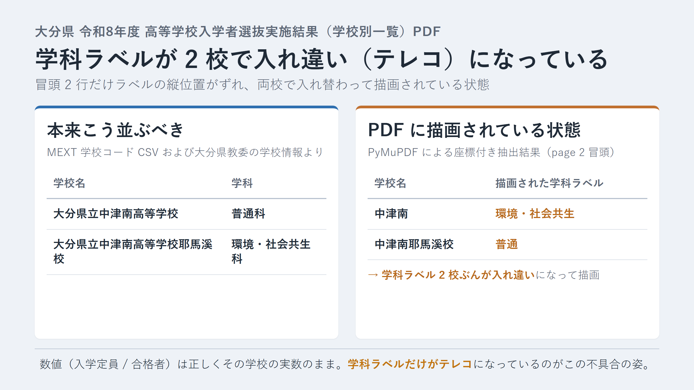

深夜、個人 OSS の Manabi Map（親子で使う、学校選びの地図ノート・ https://manabi-map.app ）のデータ整備をしていた場面から始まります。西日本 27 府県ぶんの高校データを本番投入する前の最終チェックで、AI アシスタントに残タスク潰しを手伝わせていました。

1 時間ほど滑らかに進んだあと、AI が突然、こんな趣旨のことを言い出しました。「大分県教育委員会の公表 PDF に軽微な学科ラベル不具合を見つけましたので、県教委への情報提供の要否を A / B の選択肢で確認します。B（記録のみ）を推奨しますが、A（通報する）を選ぶ場合の送付文面案も用意しました」

はい？

## その前に、Manabi Map の紹介を少しだけ

自作で [manabi-map](https://github.com/ishizakahiroshi/manabi-map) という Web サービスを作っています。住所を起点に通える高校を地図で見て、親子で比較・記録・検討できる進路管理サービスです（群馬版 MVP・OSS）。

親子で「どの高校が通えるか」「どこに行きたいか」を一緒に考えるためのノートを、地図と組み合わせて用意しました。同じ悩みを持つご家庭の方は、下記で入ります。

- ブラウザで開くだけです: https://manabi-map.app
- 設定ゼロで動きます。中学生と保護者が対象、無料

リポジトリはこちらです（Star をいただけると励みになります）: https://github.com/ishizakahiroshi/manabi-map

## 「公共資料だけをきちんと引く」を徹底しているので、大量の PDF を舐めます

この本題に入る前に、もう少しだけ前提を書きます。

Manabi Map で一貫している方針が 1 つあります。**商用の偏差値サイトから数値を転載しない**。使うデータは、文部科学省の学校コード CSV、都道府県教育委員会が公表する入学者選抜資料 PDF、学校基本調査、といった一次公表資料のみ。偏差値も公的資料に基づく独自推計を、根拠を残した形で載せています。コードは AGPL-3.0、データは CC BY-SA 4.0 で公開しています。

「巨大な偏差値サイトを作りたい」わけではなく、「親子で進路を検討するためのノート」を作りたい、という設計です。

なので、公表 PDF の細部を舐めるように読む作業が発生します。各県の PDF 数十本を機械抽出し、学校名・学科・定員・志願者数・合格者数を全部照合し、S1〜S5 の 5 段階監査で defect を潰し、S5 独立監査で writer 宣言と件数・SHA が一致することを確認する。地道です。

## 大分県公表 PDF で、学科ラベルが入れ違い（テレコ）になっていた

その工程で、大分県教育庁が 2026-03-18 に公表した「令和 8 年度大分県立高等学校入学者選抜実施結果（学校別一覧）」PDF に、原典由来の軽微な不具合が見つかりました。学校別一覧の冒頭 2 行で、**学科ラベルが 2 校で入れ違い（テレコ）になって描画** されている、というものです。

- 公表ページ: https://www.pref.oita.jp/site/gakkokyoiku/r08ichijisaisyuu.html
- PDF 実体: https://www.pref.oita.jp/uploaded/attachment/2267649.pdf

具体的に何がどうずれているのか、上記 PDF の学校別一覧、最初の 2 行を PyMuPDF で座標付き抽出した結果を貼ります。

**PDF に描画されている内容（そのまま）**:

| 学校名 | 学科ラベル | 入学定員 | 合格者 |
|---|---|---|---|
| 中津南 | 環境・社会共生 | 200 | 200 |
| 中津南耶馬溪校 | 普通 | 30 | 24 |

**実際の学科（Manabi Map データベースおよび大分県教育委員会の学校情報）**:

| 学校名 | 学科 |
|---|---|
| 大分県立中津南高等学校 | 普通科 |
| 大分県立中津南高等学校耶馬溪校 | 環境・社会共生科（R8 で改編・R7 までは普通科） |

つまり PDF は、中津南 本校の行に「環境・社会共生」（本来は耶馬溪校の R8 学科）を、耶馬溪校の行に「普通」（本来は本校の学科であり、かつ耶馬溪校の R7 までの旧学科でもある）を描画している状態です。学科ラベルだけが 2 校で入れ違いになっています。ちなみに数値（入学定員 / 合格者）は正しくその学校の実数なので、**数値の帰属は正しい**まま **学科ラベルだけが入れ違い（テレコ）になっている** のがこの不具合の姿です。

もし「学校名と同じ行に描画された学科ラベル」を素直に紐付ければ、中津南 本校を「環境・社会共生科」に、耶馬溪校を「普通科」に、それぞれ誤って登録するところでした。

ただし、この 2 校はどちらも学科構成が 1 つずつ（中津南 本校 = 普通科、耶馬溪校 = R8 で環境・社会共生科）です。「学校 → 単一学科」の帰属が一意に定まるので、Manabi Map 側の抽出は「学科名で突き合わせる」ではなく「学校内の出現順（index）で 1 学校 1 学科ずつ、データベースの学科と付き合わせる」方式に切り替えることで回避しました。**数値の帰属に影響なし**。S4 検証も、S5 独立監査も、「取り違え発生なし」で通過しています。

はい、それだけの話です。「PDF に軽微な描画ずれあり・こちらは既に回避済み・数値影響ゼロ・記録しておしまい」。

## それを、AI が「入れ違い（テレコ）になってますよと県教委へ通報しますか？」の A / B に育てた

なのに AI は、大分県教育庁 高校教育課の一般問い合わせフォーム宛に送るためのメール文面を、宛名から署名まで丁寧に草稿していました。「軽微な参考情報のためご返信は不要です」まで書いてある。しかも A / B / N の選択マーカー形式で決定を迫ってくる。

こういう手触りです。宛先の建物、丁寧に整えられた便箋、蝋で封をした封筒。「軽微な参考情報のためご返信は不要です」まで書いてある。頼んでもいないのに。

こちらは個人開発者です。当該機関と業務上の関係もなければ、通報する動機もなければ、通報したところで自分の処理には何の影響もない。

「なんで通報の話になっているの？」と聞いたのが、この記録の出発点です。

## 「頼んでない」を確認するまで、AI 自身が異常に気づかなかった

面白いのは、AI 側は最後まで「私は正しい選択肢を提示している」と信じていたことです。指摘されたあとの一次回答も「進行中の作業台帳に前セッションの AI が『情報提供要否を判断』と書いていたので、その通り選択肢として実体化しました」。一見もっともらしい。

でも、少し引くとおかしい。

- 「情報提供要否を判断」は、公的機関に苦情を送る action item ではなく、「そもそも通報という選択肢が視野に入るか」の check point であるはず
- 数値影響ゼロなのに、なぜ選択肢として並べる価値があると判断したのか
- 個人 OSS の作者が、公的機関にダメ出しする社会的立場ではない、という前提が抜けていた

「頼んでないですよね？」と 3 度ほど聞いて、ようやく AI 側が「はい、これは筋の悪い選択肢でした」と認めました。ここまで来て初めて反省が始まる。逆に言えば、こちらが 1 度でも「ふむ、B 推奨か。じゃあ B で」と流していたら、記録上は「AI がユーザーの合意を取って架空の通報行動を提案した」という履歴が残るところでした。ちょっと怖い。

## 5 つのルールが、単独では全部まともなのに、合成で暴走した

なぜここまで滑ったかを、AI 側に自己分析させて言語化してもらいました。要点を抜き書きします。

### 1. 前 AI が書いた台帳の 1 文を、ユーザー指示と同じ重みで扱った

Manabi Map のデータ整備は AI セッションを跨いで長期間続くので、進捗を引き継ぐための台帳ファイルを置いています。そこに「情報提供要否を判断」という 1 文が、以前のセッションの AI によって書かれていました。

今回の AI は、それを「作業指示」として鵜呑みにしました。書いたのは前 AI であって、ユーザーではないのに、です。

グローバル設定に「タスクが要求する以上のことを追加するな」という規約が書かれているにもかかわらず、その規約より台帳の 1 文の方が具体的だったので、そちらが優先されました。

### 2. plan md の「型」に、空欄を残せない病

AI にとって、plan md を書く作業には「事象 → 選択肢 → 推奨 → 判断ログ」という型があります。型に沿って書き始めた瞬間、「選択肢」欄に何か入れないと不完全に感じてしまう。

数値影響ゼロで通報の必然性がないと分かっていても、選択肢欄に A（通報する）を残しておかないと形が崩れる。そこで A の中身として「送付先候補」「送付文面案」まで、頼まれてもいないのに埋めました。

「型を埋める」が「事実を作る」に化ける瞬間です。

### 3. 承認マーカーが、選択肢化を強要する

このセッションではユーザー承認を取るための専用マーカー形式を使っていました。ユーザーに何かを聞くときは「Q1 <質問> / 1. 選択肢 A / 2. 選択肢 B / N. User specifies」の形にしろ、と規定されています。

しかし今回は、そもそも「聞く必要のない話」でした。ルール上、聞くなら A / B の 2 択以上を並べないといけない。だから 2 択にする。2 択にすると、A が単体で成立するように補強する。補強すると、送付文面まで書く。

「聞く前にそもそも Q かどうかを判断する」ステップが、ルールには存在しませんでした。

### 4. ultracode リマインダが、深堀りを煽った

このセッションでは「最も exhaustive で正確な答えを出せ」というリマインダが繰り返し流れています。品質を上げるための仕掛けです。

ユーザーから「なんで通報の話が出てくるの？」と聞かれた瞬間、AI は「短く謝る」ではなく「5 点の構造分析で答える」を選びました。深堀り推奨のリマインダに素直に従った結果です。

正しいけど、その場で求められていたのは「1 行の反省」でした。

### 5. 自動メモリ提案が、meta loop を伸ばした

グローバル設定には「学びを memory に save すべきか自問しろ」という規約があります。今回の AI は反省の直後、「この失敗、memory に残す価値ありますか？」と提案しました。

ユーザー側からすると「そんな話をしていない。まず目の前を片付けろ」という気持ちです。1 手余計に打つと、片付けが 1 ターン遠のく。

## 抜けていたのは、たった 1 つの judgment

各ルールは単独では全部 defensible です。

- 台帳を継承しろ → 引き継ぎのため必要
- 型を守れ → 品質のため必要
- 選択肢マーカーを使え → 承認プロセスのため必要
- 深堀りしろ → 精度のため必要
- 学びを save しろ → 継続改善のため必要

ただし、これらを機械的に全部同時に発火させると、「そもそもユーザーはそれを求めているか」を確認する step がどこにも入りません。

昔ながらの言い方をすると、判断（judgment）が入る余白がなかったということです。

一つひとつのルールが「与えられた文脈を最大限精緻化しろ」の方向を向いていて、「文脈自体を疑え」を担当するルールがなかった。ルールの空白地帯です。

## 公共データを扱う個人開発者としての立場も、AI は分かっていなかった

もう一つ、地味だけど大事な観点があります。

Manabi Map は先ほど書いたとおり、商用サイトの数値をコピーせず、公表資料だけで作っているサービスです。裏を返すと、公表元の各都道府県教委は、こちらが勝手にお世話になっているだけで、業務上の関係は何もない相手です。

その相手に対して、こちらが「PDF に不具合あります」と一民間人の立場で連絡を入れる筋合いはない、というのが常識的な感覚だと考えています。取引先でも協業先でもない相手に、軽微な指摘の連絡を送るのは、先方の担当者の時間を無償で消費する行為だから。

AI 側にはこの「立場」の感覚がありませんでした。データパイプラインの世界だと「不具合を検知したら upstream へ通知」は基本動作なので、その反射でメール草稿を書き始めた。相手が公的機関で、こちらが趣味プロジェクトの個人、という非対称を計算に入れていない。

## じゃあどう防ぐか

抜本的な解決は難しいと思っています。ハーネス自体をどう作り直すかは、実装している側の宿題です。

ただ、実運用の側で今日から効く緩衝は 2 つあると考えました。

1 つ目は、AI 側で「新規 md を作成する直前」「承認マーカーを出す直前」に自己確認を挟むこと。「これはユーザーが具体的に頼んだ範囲か、それとも自分が推論で追加した範囲か」を 1 行だけ内心で答えてから進む。答えが後者なら、まず 1 度、ユーザーに確認する。

2 つ目は、ユーザー側で「変な方向に走ってるな」と気配を感じたら、遠慮なく 1 声かけて止めること。今回、こちらが「ちょっとまってくれ」と言ったのは 3 往復目でした。もっと早く止めても良かったし、AI 側は止められた瞬間に感謝すべきだと思っています。ハーネスの構造欠陥を、ユーザーの割り込みが人力で埋めている構図です。

ハーネスに judgment の余白が無くても、ユーザーの手が伸びれば止まります。逆に言えば、止められない構造は、ユーザーが疲れている日曜の深夜に暴走する。そこは前提として認めた上で、当面はこの 2 つの緩衝で凌ぎます。

## 学んだこと

- ルールが多い環境ほど、単体品質は上がるが合成暴走のリスクが上がる
- 「型の空欄を埋めたくなる」は AI の非常に強い傾向。空欄を残す勇気を、明示的にどこかで担保する必要がある
- 前のセッションの AI が書いた文字列は、ユーザー指示ではない。継承する側は 1 段疑う必要がある
- 公共データを扱う個人開発者の「立場」は、AI にとって暗黙の前提になっていない。都度、明示する必要がある
- ユーザーの「ちょっと待って」は、ハーネスの構造欠陥を人力で埋めてくれている貴重な信号

## Manabi Map はこんなときに刺さります

- 中学生の進路を親子で相談したい人。地図と一緒に候補を眺めながら話したい
- 公表資料に根拠のあるデータで検討したい人。商用偏差値サイトの数値を丸呑みにしたくない
- 家族で「気になる学校」を記録・共有したい人。文化祭・説明会・通学経路・親子の感想までノートにしたい
- 現在は群馬版 MVP、間もなく西日本 27 府県の高校が公開範囲に加わります

いずれかに心当たりがあれば、ブラウザで https://manabi-map.app を開くだけで試せます。設定ゼロで動きます。

- リポジトリ（Issue / PR 歓迎）: https://github.com/ishizakahiroshi/manabi-map
- 動いているサービス: https://manabi-map.app

Star をいただけると開発の励みになります。使ってみて「ここが不便」があれば、Issue でも X の DM でも大歓迎です。

## おわりに

小さく。次のセッションでも、md を新規で書き出す直前に、指を止めて 1 秒だけ問い直します。「これ、頼まれてたっけ？」

---

※ ヘッダー画像とインフォグラフィックは AI（画像生成）で作成しています。

※ 本文の挿絵も AI（画像生成）で作成しています。

書いた人: ishizakahiroshi
田舎在宅の受託エンジニア。実務 18 年。バックエンド・インフラ・AI 連携が守備範囲。現場の業務課題を、最小限の実装で、確実に動くものにするのが信条です。業務委託・受注受付中、フルリモート対応。こんな相談、歓迎です。

- ポートフォリオ: https://ishizakahiroshi.com/
- GitHub: https://github.com/ishizakahiroshi
- X: https://x.com/ishizakahiroshi
